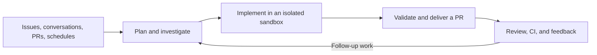

  <a href="https://github.com/langchain-ai/open-swe">
    <picture>
      <source media="(prefers-color-scheme: dark)" srcset="assets/dark.svg">
      <source media="(prefers-color-scheme: light)" srcset="assets/light.svg">
      
    </picture>
  </a>

  <h3>An open-source software factory built on Deep Agents by LangChain.</h3>

  
  
  
  
  

 

Open SWE turns engineering work into a repeatable system: investigate a codebase, implement changes, validate them, and deliver a pull request. It also reviews pull requests, learns repository-specific review preferences, monitors CI, and responds to feedback. Built by LangChain, it is open source and deployable in your infrastructure.

> [!NOTE]
> **Under active development.** Expect breaking changes and rough edges. We’re not accepting issues or external contributions at this time. You’re welcome to explore and fork the code, but correctness, stability, and compatibility are not guaranteed.

## Getting started

- **[Deploy for a team](docs/INSTALLATION.md)** — Set up the backend, dashboard, GitHub and Slack apps, and model credentials. Production standalone Agent Server deployments require a license key.
- **[Develop locally](docs/DEVELOPMENT.md)** — Follow the ordered setup for dependencies, credentials, the database, hot reload, and a webhook-only tunnel.
- **[Desktop (experimental)](docs/DEVELOPMENT.md#desktop-app-experimental)** — Work against local repositories. Packaged app releases target macOS; source builds also support Windows and Linux.
- **[Use the CLI](cli/README.md)** — Connect a local directory to an agent on your deployment. Commands execute locally as you, without sandbox isolation.

## What Open SWE does

- **Build:** Investigate repositories, edit code, run focused validation, and open or update pull requests.
- **Parallelize:** Use subagents for research and independent work.
- **Review:** Run on-demand or opt-in automatic reviews, publish findings to GitHub, and learn from historical feedback.
- **Investigate:** Use read-only PR chat to understand a change without implementing changes.
- **Operate:** Schedule recurring tasks and monitor opted-in PRs with `/baby-sit`, diagnosing failures and rerunning only evidence-backed flaky jobs.
- **Customize:** Choose models, reasoning effort, instructions, skills, integrations, and sandbox providers.

Start and continue work from the **dashboard**, **GitHub issues and PR conversations**, or **Slack**. In [Linear](docs/INSTALLATION.md#linear), delegate an issue to Open SWE or @mention it: it works as a Linear agent, showing progress in the issue's agent session and replying with its answer and pull request. From Slack, ask it to file the Linear issue first. On [GitLab](docs/INSTALLATION.md#gitlab), @mention it on an issue or merge request, or assign it an issue: it works on the GitLab project and replies with a merge request. Cloud coding follow-ups reuse the thread’s context and sandbox; independent threads can run in parallel.

## How it works

[Deep Agents](https://github.com/langchain-ai/deepagents) supplies planning, filesystem, shell, skills, and subagent primitives. [LangGraph](https://github.com/langchain-ai/langgraph) provides durable execution and thread state. Open SWE adds engineering tools, integrations, authorization, and user interfaces. The graph entrypoints are declared in [`langgraph.json`](langgraph.json), with an [architecture inventory](AGENTS.md#architecture).

Cloud coding runs in persistent, per-thread Linux sandboxes with tooling supplied by workspace scripts or snapshots. An unreachable coding sandbox is not silently replaced. [LangSmith](https://smith.langchain.com/) is the default sandbox and tracing provider; [other providers and local execution](docs/CUSTOMIZATION.md#1-sandbox) are configurable. PR chat does not need a sandbox.

## Control and safety

- **GitHub access:** Coding sandboxes normally receive installation-wide GitHub App access; selected workflows use narrower repository scopes. Workspace repository bindings control routing and preloaded checkouts, not a separate credential boundary. See [GitHub access](docs/reference/workspaces.md#github-access-and-the-sandbox-image).
- **Integrations:** MCP connections layer instance-wide, workspace-specific, and personal tools. Configure their scope and credentials in the [customization guide](docs/CUSTOMIZATION.md#workspace-mcp-servers).
- **Approvals:** Workflow-file approval prompts guard detected Git pushes, not every possible shell or API write. Reviewers are instructed not to commit or push; PR chat excludes mutation tools.

Sandboxes have powerful tools and may have network access. Use least-privilege credentials, restrict repositories and integrations, and tailor approval policies to your deployment. Local execution does not provide cloud sandbox isolation.

## Documentation

- [Customization guide](docs/CUSTOMIZATION.md) — Models, sandboxes, tools, skills, prompts, triggers, and middleware
- [Workspaces reference](docs/reference/workspaces.md) — Routing, settings, images, and access
- [Human review in Slack](docs/reference/human-review.md) — Review requests in a repository's Slack channel, merged once reviewers approve
- [Expedited Slack review](docs/reference/expedited-slack-review.md) — Human approval for small pull requests
- [Backend API documentation](docs/DEVELOPMENT.md#backend-api-documentation) — Live API docs and the generated [OpenAPI schema](swagger.json)
- [Original announcement](https://blog.langchain.com/open-swe-an-open-source-framework-for-internal-coding-agents/) — Background on the internal coding-agent framework
- [Security policy](SECURITY.md) — Report security concerns privately

## License

Open SWE is licensed under the [MIT License](LICENSE).

## Español

Open SWE convierte el trabajo de ingeniería en un sistema repetible: investiga una base de código, implementa cambios, los valida y entrega una solicitud de incorporación de cambios (pull request). También revisa solicitudes de incorporación de cambios, aprende las preferencias de revisión específicas de cada repositorio, supervisa la integración continua (CI) y responde a los comentarios. Creado por LangChain, es de código abierto y se puede desplegar en su propia infraestructura.

> [!NOTE]
> **En desarrollo activo.** Pueden producirse cambios incompatibles y aún hay aspectos sin pulir. Por el momento no aceptamos incidencias ni contribuciones externas. Puede explorar el código y crear una bifurcación (fork), pero no se garantizan la exactitud, la estabilidad ni la compatibilidad.

### Primeros pasos

- **[Desplegar para un equipo](docs/INSTALLATION.md)** — Configure el backend, el panel de control, las aplicaciones de GitHub y Slack, y las credenciales de los modelos. Los despliegues de producción de Agent Server independiente requieren una clave de licencia.
- **[Desarrollar localmente](docs/DEVELOPMENT.md)** — Siga, en orden, la configuración de dependencias, credenciales, base de datos, recarga en caliente y un túnel exclusivo para webhooks.
- **[Aplicación de escritorio (experimental)](docs/DEVELOPMENT.md#desktop-app-experimental)** — Trabaje con repositorios locales. Las versiones empaquetadas de la aplicación están destinadas a macOS; las compilaciones desde el código fuente también son compatibles con Windows y Linux.
- **[Usar la CLI](cli/README.md)** — Conecte un directorio local a un agente de su despliegue. Los comandos se ejecutan localmente con su usuario, sin el aislamiento de un entorno aislado (sandbox).

### Qué hace Open SWE

- **Desarrollar:** Investiga repositorios, edita código, ejecuta validaciones específicas y abre o actualiza solicitudes de incorporación de cambios.
- **Paralelizar:** Utiliza subagentes para la investigación y el trabajo independiente.
- **Revisar:** Ejecuta revisiones bajo demanda o automáticas (si se activan), publica los hallazgos en GitHub y aprende de los comentarios anteriores.
- **Investigar:** Utiliza el chat de solo lectura sobre solicitudes de incorporación de cambios para comprender un cambio sin implementar modificaciones.
- **Operar:** Programa tareas periódicas y supervisa las solicitudes de incorporación de cambios inscritas con `/baby-sit`, diagnostica fallos y vuelve a ejecutar solo los trabajos inestables cuando hay evidencia que lo respalde.
- **Personalizar:** Elija modelos, nivel de razonamiento, instrucciones, habilidades (skills), integraciones y proveedores de entornos aislados.

Inicie y continúe el trabajo desde el **panel de control**, las **conversaciones de incidencias y solicitudes de incorporación de cambios de GitHub** o **Slack**. En [Linear](docs/INSTALLATION.md#linear), delegue una incidencia a Open SWE o menciónelo con @: funciona como un agente de Linear, muestra el progreso en la sesión de agente de la incidencia y responde con su respuesta y la solicitud de incorporación de cambios. Desde Slack, pídale que primero cree la incidencia en Linear. En [GitLab](docs/INSTALLATION.md#gitlab), menciónelo con @ en una incidencia o solicitud de fusión (merge request), o asígnele una incidencia: trabaja en el proyecto de GitLab y responde con una solicitud de fusión. Los seguimientos de programación en la nube reutilizan el contexto y el entorno aislado de la conversación; las conversaciones independientes pueden ejecutarse en paralelo.

### Cómo funciona

[Deep Agents](https://github.com/langchain-ai/deepagents) proporciona las primitivas de planificación, sistema de archivos, terminal, habilidades y subagentes. [LangGraph](https://github.com/langchain-ai/langgraph) ofrece ejecución duradera y el estado de las conversaciones. Open SWE añade herramientas de ingeniería, integraciones, autorización e interfaces de usuario. Los puntos de entrada de los grafos se declaran en [`langgraph.json`](langgraph.json), junto con un [inventario de la arquitectura](AGENTS.md#architecture).

La programación en la nube se ejecuta en entornos aislados de Linux persistentes, uno por conversación, con herramientas proporcionadas por scripts o instantáneas del espacio de trabajo. Un entorno aislado de programación inaccesible no se reemplaza de forma silenciosa. [LangSmith](https://smith.langchain.com/) es el proveedor predeterminado de entornos aislados y de trazas; [otros proveedores y la ejecución local](docs/CUSTOMIZATION.md#1-sandbox) son configurables. El chat sobre solicitudes de incorporación de cambios no necesita un entorno aislado.

### Control y seguridad

- **Acceso a GitHub:** Los entornos aislados de programación normalmente reciben acceso de la aplicación de GitHub a toda la instalación; algunos flujos de trabajo usan permisos más restringidos por repositorio. Las vinculaciones de repositorios del espacio de trabajo controlan el enrutamiento y las copias precargadas, no un límite de credenciales independiente. Consulte [Acceso a GitHub](docs/reference/workspaces.md#github-access-and-the-sandbox-image).
- **Integraciones:** Las conexiones MCP combinan herramientas de toda la instancia, específicas del espacio de trabajo y personales. Configure su alcance y sus credenciales en la [guía de personalización](docs/CUSTOMIZATION.md#workspace-mcp-servers).
- **Aprobaciones:** Las solicitudes de aprobación de archivos de flujo de trabajo protegen los envíos (push) de Git detectados, no todas las escrituras posibles mediante la terminal o la API. Los revisores tienen instrucciones de no confirmar (commit) ni enviar cambios; el chat sobre solicitudes de incorporación de cambios excluye las herramientas de modificación.

Los entornos aislados tienen herramientas potentes y pueden tener acceso a la red. Utilice credenciales con el mínimo privilegio, restrinja los repositorios y las integraciones, y adapte las políticas de aprobación a su despliegue. La ejecución local no ofrece el aislamiento de un entorno aislado en la nube.

### Documentación

- [Guía de personalización](docs/CUSTOMIZATION.md) — Modelos, entornos aislados, herramientas, habilidades, instrucciones (prompts), desencadenadores y middleware
- [Referencia de espacios de trabajo](docs/reference/workspaces.md) — Enrutamiento, configuración, imágenes y acceso
- [Revisión humana en Slack](docs/reference/human-review.md) — Solicitudes de revisión en el canal de Slack de un repositorio, que se fusionan cuando los revisores las aprueban
- [Revisión acelerada en Slack](docs/reference/expedited-slack-review.md) — Aprobación humana para solicitudes de incorporación de cambios pequeñas
- [Documentación de la API del backend](docs/DEVELOPMENT.md#backend-api-documentation) — Documentación de la API en vivo y el [esquema OpenAPI](swagger.json) generado
- [Anuncio original](https://blog.langchain.com/open-swe-an-open-source-framework-for-internal-coding-agents/) — Contexto sobre el marco de trabajo para agentes de programación internos
- [Política de seguridad](SECURITY.md) — Informe de problemas de seguridad de forma privada

### Licencia

Open SWE se distribuye bajo la [Licencia MIT](LICENSE).
