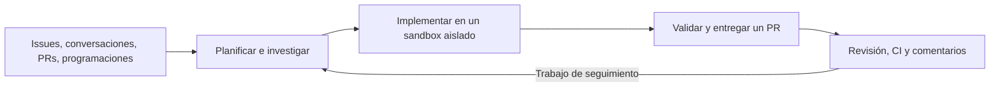

  <a href="https://github.com/langchain-ai/open-swe">
    <picture>
      <source media="(prefers-color-scheme: dark)" srcset="assets/dark.svg">
      <source media="(prefers-color-scheme: light)" srcset="assets/light.svg">
      
    </picture>
  </a>

  <h3>Una fábrica de software de código abierto construida sobre Deep Agents por LangChain.</h3>

  
  
  
  
  

 

Open SWE convierte el trabajo de ingeniería en un sistema repetible: investiga una base de código, implementa cambios, los valida y entrega un pull request. También revisa pull requests, aprende las preferencias de revisión específicas de cada repositorio, supervisa la CI y responde a los comentarios. Desarrollado por LangChain, es de código abierto y se puede desplegar en tu propia infraestructura.

> [!NOTE]
> **En desarrollo activo.** Espera cambios incompatibles y asperezas. Por ahora no aceptamos issues ni contribuciones externas. Puedes explorar y hacer fork del código, pero no se garantizan su corrección, estabilidad ni compatibilidad.

## Primeros pasos

- **[Desplegar para un equipo](docs/INSTALLATION.md)** — Configura el backend, el dashboard, las apps de GitHub y Slack, y las credenciales de los modelos. Los despliegues de producción de Agent Server independiente requieren una clave de licencia.
- **[Desarrollar localmente](docs/DEVELOPMENT.md)** — Sigue la configuración ordenada de dependencias, credenciales, base de datos, recarga en caliente y un túnel solo para webhooks.
- **[Escritorio (experimental)](docs/DEVELOPMENT.md#desktop-app-experimental)** — Trabaja sobre repositorios locales. Las versiones empaquetadas de la app son para macOS; las compilaciones desde el código fuente también admiten Windows y Linux.
- **[Usar la CLI](cli/README.md)** — Conecta un directorio local a un agente de tu despliegue. Los comandos se ejecutan localmente con tu usuario, sin aislamiento de sandbox.

## Qué hace Open SWE

- **Construir:** Investiga repositorios, edita código, ejecuta validaciones específicas y abre o actualiza pull requests.
- **Paralelizar:** Usa subagentes para la investigación y el trabajo independiente.
- **Revisar:** Ejecuta revisiones bajo demanda o automáticas (opcionales), publica los hallazgos en GitHub y aprende de los comentarios históricos.
- **Investigar:** Usa el chat de PR de solo lectura para entender un cambio sin implementar cambios.
- **Operar:** Programa tareas recurrentes y supervisa los PRs inscritos con `/baby-sit`, diagnosticando fallos y volviendo a ejecutar solo los jobs inestables respaldados por evidencia.
- **Personalizar:** Elige modelos, nivel de razonamiento, instrucciones, skills, integraciones y proveedores de sandbox.

Inicia y continúa el trabajo desde el **dashboard**, las **issues y conversaciones de PR de GitHub** o **Slack**. [Linear](docs/INSTALLATION.md#linear) admite activadores mediante comentarios en issues y respuestas a través de una conexión MCP de Linear configurada. Los seguimientos de codificación en la nube reutilizan el contexto y el sandbox del hilo; los hilos independientes pueden ejecutarse en paralelo.

## Cómo funciona

[Deep Agents](https://github.com/langchain-ai/deepagents) proporciona primitivas de planificación, sistema de archivos, shell, skills y subagentes. [LangGraph](https://github.com/langchain-ai/langgraph) ofrece ejecución duradera y estado de los hilos. Open SWE añade herramientas de ingeniería, integraciones, autorización e interfaces de usuario. Los puntos de entrada de los grafos se declaran en [`langgraph.json`](langgraph.json), con un [inventario de la arquitectura](AGENTS.md#architecture).

La codificación en la nube se ejecuta en sandboxes Linux persistentes por hilo, con herramientas proporcionadas por scripts o snapshots del workspace. Un sandbox de codificación inaccesible no se reemplaza de forma silenciosa. [LangSmith](https://smith.langchain.com/) es el proveedor predeterminado de sandbox y trazas; [otros proveedores y la ejecución local](docs/CUSTOMIZATION.md#1-sandbox) son configurables. El chat de PR no necesita un sandbox.

## Control y seguridad

- **Acceso a GitHub:** Los sandboxes de codificación normalmente reciben acceso de la GitHub App a toda la instalación; algunos flujos de trabajo usan alcances de repositorio más restringidos. Las vinculaciones de repositorios del workspace controlan el enrutamiento y los checkouts precargados, no un límite de credenciales independiente. Consulta [Acceso a GitHub](docs/reference/workspaces.md#github-access-and-the-sandbox-image).
- **Integraciones:** Las conexiones MCP combinan herramientas de toda la instancia, específicas del workspace y personales. Configura su alcance y credenciales en la [guía de personalización](docs/CUSTOMIZATION.md#workspace-mcp-servers).
- **Aprobaciones:** Las solicitudes de aprobación de archivos de workflow protegen los pushes de Git detectados, no todas las posibles escrituras por shell o API. Se indica a los revisores que no hagan commit ni push; el chat de PR excluye las herramientas de modificación.

Los sandboxes tienen herramientas potentes y pueden tener acceso a la red. Usa credenciales con privilegios mínimos, restringe repositorios e integraciones, y adapta las políticas de aprobación a tu despliegue. La ejecución local no ofrece el aislamiento de los sandboxes en la nube.

## Documentación

- [Guía de personalización](docs/CUSTOMIZATION.md) — Modelos, sandboxes, herramientas, skills, prompts, activadores y middleware
- [Referencia de workspaces](docs/reference/workspaces.md) — Enrutamiento, configuración, imágenes y acceso
- [Revisión humana en Slack](docs/reference/human-review.md) — Solicitudes de revisión en el canal de Slack de un repositorio, fusionadas cuando los revisores aprueban
- [Revisión acelerada en Slack](docs/reference/expedited-slack-review.md) — Aprobación humana para pull requests pequeños
- [Documentación de la API del backend](docs/DEVELOPMENT.md#backend-api-documentation) — Documentación de la API en vivo y el [esquema OpenAPI](swagger.json) generado
- [Anuncio original](https://blog.langchain.com/open-swe-an-open-source-framework-for-internal-coding-agents/) — Contexto sobre el framework de agentes de codificación internos
- [Política de seguridad](SECURITY.md) — Informa de problemas de seguridad de forma privada

## Licencia

Open SWE está licenciado bajo la [Licencia MIT](LICENSE).
